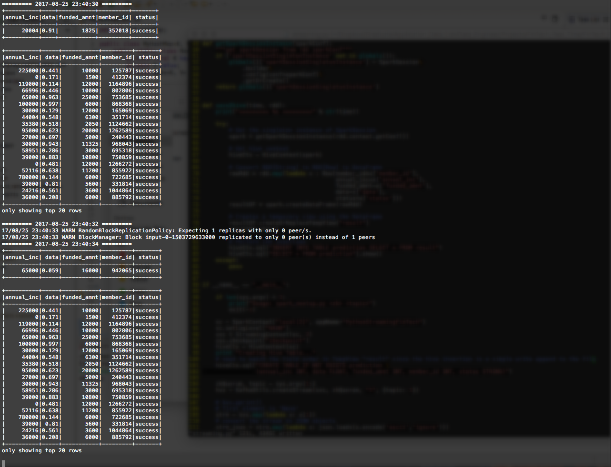

# README

## Flow chart


## Steps to run the application:

### 1. Prerequisites:
* spark-2.1.1-bin-hadoop2.7 (or using `conda install -c conda-forge pyspark=2.1.1` to install pyspark packages for Anaconda)
* kafka_2.11-0.10.2.0
* kafka-python (https://kafka-python.readthedocs.io/en/master/install.html) needs to be imported for "source.py"
 
### 2. Start Zookeeper/Kafka-server in local mode; skip this step in cluster mode

```bash
$ bin/zookeeper-server-start.sh config/zookeeper.properties
$ bin/kafka-server-start.sh config/server.properties
```
 
### 3. Create topic:

```bash
# local mode
$ kafka-topics.sh --create --zookeeper localhost:2181 --replication-factor 1 --partitions 1 --topic fintech_pyspark
$ kafka-topics.sh --list --zookeeper localhost:2181
```

or 

```bash
# cluster mode
$ /usr/hdp/current/kafka-broker/bin/kafka-topics.sh --create --zookeeper m1.mt.dataapplab.com:2181 --replication-factor 1 --partitions 1 --topic fintech_pyspark
$ /usr/hdp/current/kafka-broker/bin/kafka-topics.sh --list --zookeeper m1.mt.dataapplab.com:2181
```
 
### 4. Start Kafka source

```bash
# local mode
$ python source.py local
```

or 

```bash
# cluster mode
$ python source.py cluster
```
 
### 5. Submit Spark job

```bash
# local mode
$ spark-submit --packages org.apache.spark:spark-streaming-kafka-0-8_2.11:2.0.1 streaming.py local fintech_pyspark
```

or

```bash
# if multiple Spark version exists, need to specify SPARK_MAJOR_VERSION
$ export SPARK_MAJOR_VERSION = 2
$ export SPARK_HOME=/usr/hdp/current/spark2-client
$ export PYTHONPATH=$SPARK_HOME/python/:$PYTHONPATH
$ export PYTHONPATH=$SPARK_HOME/python/lib/py4j-0.10.3-src.zip:$PYTHONPATH

# cluster mode
$ spark-submit --packages org.apache.spark:spark-streaming-kafka-0-8_2.11:2.0.1 --master yarn --deploy-mode cluster --files /usr/hdp/current/spark-client/conf/hive-site.xml --py-files lib.zip streaming.py cluster fintech_pyspark
```

To check log file in cluster mode

```bash
$ yarn logs -applicationId <application_1497235459582_2234>
```

#### 5.1 Submitting Python Dependencies in PySpark Jobs

For submitting simple python dependencies, package all your modules into a `.egg` or `.zip` file.

For submitting complex python dependencies, you will have to manually manage everything since it's not yet supported in Spark.

Using [virtualenv](https://pypi.python.org/pypi/virtualenv) to create a virtual Python environment. Follow the instructions [here](https://virtualenv.pypa.io/en/stable/userguide/) after installation. As shown in [here](https://stackoverflow.com/questions/29495435/easiest-way-to-install-python-dependencies-on-spark-executor-nodes), run a fresh `pip install` for all your own in-house Python libraries. If you have set these up with `setuptools`, this will install all dependencies automatically. Zip-up all contents of site-packages dir of the virtualenv, not the site-package dir itself. This will include all libs for dedicated use which the worker nodes will need, but not the standard Python libs, which they already have.
 
Inside the PySpark application, config your SparkContext via `sc.addPyFile(*.zip)`. When submitting the PySpark job, containing the zip files as an argument to `--py-files` in `spark-submit` command.

An assumption that anyone doing distributed computing with commodity hardware must assume is that the underlying hardware is potentially heterogeneous. A Python egg built on a client machine will be specific to the client’s CPU architecture because of the required C compilation. Distributing an egg for a complex, compiled package like NumPy, SciPy, or pandas is a brittle solution that is likely to fail on most clusters, at least eventually. This means we should prefer the alternative approach: have our required Python packages already installed on each node of the cluster and specify the path to the Python binaries for the worker nodes to use.

Also, for complex packages that require pre-compilation, the method above won't work. You need to install the package for each worker node individually.


## Snapshot of the Application in Local Mode




## Snapshot of the Application in Cluster Mode


## Known Problem and Future Improvements

1. Records are inserted to Hive in the granularity of RDD, generating too many small files in Hive internal table's metastore; HBase may be a better candidate of data warehouse in streaming application


## References

1. Design Patterns for using foreachRDD (one of the output operations on DStream)
`https://spark.apache.org/docs/latest/streaming-programming-guide.html#output-operations-on-dstreams`

2. Example of using Spark SQL with DStream
`https://github.com/apache/spark/blob/v2.2.0/examples/src/main/python/streaming/sql_network_wordcount.py`

3. ETL Using Spark Streaming and Hive (Scala)
`https://vivekmangipudi.wordpress.com/2017/02/13/hive-etl-spark-streaming-with-hive/`

4. Running Spark on YARN with Hadoop Cluster
`https://nofluffjuststuff.com/blog/mark_johnson/2016/02/5_steps_to_get_started_running_spark_on_yarn_with_a_hadoop_cluster`

5. Setting Up Hive Metastore Warehouse Directory in Spark Streaming Application
`https://community.mapr.com/thread/19316-objectstore-failed-to-get-database-default-returning-nosuchobjectexception`

6. Best Practices Writing Production-Grade PySpark Jobs
`https://developerzen.com/best-practices-writing-production-grade-pyspark-jobs-cb688ac4d20f`

7. Maintaining Dependencies for PySpark Jobs
`https://blog.cloudera.com/blog/2015/09/how-to-prepare-your-apache-hadoop-cluster-for-pyspark-jobs/`
