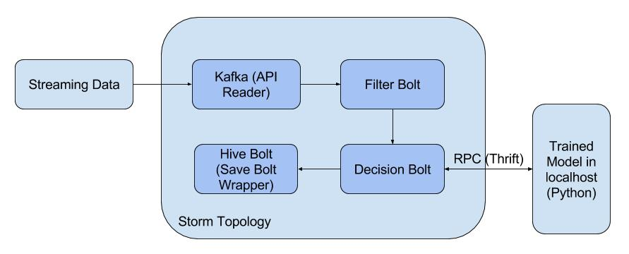

This project impelemtns a FinTech real-time processing topology using Apache Storm. It subscribes streaming data of applicants' financial information from a Kafka source, makes the decision based on trained model, and stores the data into Hive.

The topology connects to the trained model either from a Web API, like this:


or by RPC (Remote Procedure Call) using Apache Thrift, like this:




## Prerequisites

* The project is developed under Cloudera VM (CDH - 5.8.0). The use of VM will dramatically reduce the configuration effort
* GCC of version 4.8.0. How to upgrade GCC version can be found [here](http://blog.csdn.net/u014028392/article/details/70139152)
* The model is trained using XGBoost. How to install XGBoost can be found [here](http://www.itwendao.com/article/detail/400486.html)
* Apache Thrift is required for RPC invokation. How to install Apache Thrift can be found [here](https://thrift.apache.org/tutorial/). Note you might encounter the error message like this:
`configure: error: Bison version 2.5 or higher must be installed on the system!`
You should be able to resolve the error by reading [this](https://thrift.apache.org/docs/install/centos). To resolve other Apache Thrift dependencies on CentOS/RedHat/CDH, read [this](https://thrift.apache.org/docs/install/centos)
* To use Thrift with Java, you may need to compile the Java Thrift libraries and add the `libthrift.jar` file to your classpath. The build uses Apache Ant. Detail can be found [here](https://github.com/apache/thrift/tree/master/lib/java)
* To use Thrift with Python, you may need to install Thrift packages using `pip install thrift`
* If Kafka server is not install in CDH (which is the case in my machine), follow the step 1 & 2 [here](https://kafka.apache.org/quickstart) to start Kafka server. Note CDH should come with ZooKeeper by default, thus you don't need to start the ZooKeeper instance
* The project is a Maven project. Other requirements are specified in the POM.xml file


## Storm-Hive Integration

Starting from Storm 0.10.0, HiveBolt is added to support Storm-Hive integration. How to configure HiveBolt can be found [here](http://henning.kropponline.de/2015/01/24/hive-streaming-with-storm/).

In this project, all hive related configuration is in `SaveBoltWrapper.java` and `resources/config.properties`.

Note, before the topology is running, the Hive table should be created first.

```bash
hive> source hive.schema
```

The `hive.schema` file will create new tables. it looks like this:

```sql
USE alick_db;

DROP TABLE IF EXISTS fintech_result;

CREATE TABLE fintech_result(
	member_id INT,
	annual_inc INT,
	funded_amnt INT,
	data FLOAT,
	status STRING
)
CLUSTERED BY (member_id) into 1 buckets
STORED AS ORC
tblproperties("transactional"="true");
```

The HiveBolt has other restrictions to Hive table:

* Hive table must be stored in ORC format
* Hive table must be bucketed. Partition can be supported along with bucket definition, but it's optional
* There must be sufficient temporary space to support compaction operations
* Need to specify the table as "transactional", to tell Hive to utilize the transactional features


## Schema

The streaming data from Kafka source is in JSON format, and it looks like this:

```json
{
  "acc_now_delinq": "0", 
  "acc_open_past_24mths": "", 
  "addr_state": "MA", 
  "all_util": "", 
  "annual_inc": "86004", 
  "annual_inc_joint": "", 
  "application_type": "INDIVIDUAL", 
  "avg_cur_bal": "", 
  "bc_open_to_buy": "", 
  "bc_util": "", 
  "chargeoff_within_12_mths": "0", 
  "collection_recovery_fee": "0.0", 
  "collections_12_mths_ex_med": "0", 
  "delinq_2yrs": "0", 
  "delinq_amnt": "0", 
  "desc": "", 
  "dti": "5.89", 
  "dti_joint": "", 
  "earliest_cr_line": "Nov-1990", 
  "emp_length": "4 years", 
  "emp_title": "PaperThin", 
  "funded_amnt": "17000", 
  "funded_amnt_inv": "16875", 
  "grade": "D", 
  "home_ownership": "MORTGAGE", 
  "id": "24963", 
  "il_util": "", 
  "initial_list_status": "f", 
  "inq_fi": "", 
  "inq_last_12m": "", 
  "inq_last_6mths": "0", 
  "installment": "409.63", 
  "int_rate": " 15.58%", 
  "issue_d": "Oct-2010", 
  "last_credit_pull_d": "Apr-2016", 
  "last_pymnt_amnt": "840.02", 
  "member_id": "751972", 
  "mo_sin_old_il_acct": "", 
  "num_accts_ever_120_pd": "", 
  "num_actv_bc_tl": "", 
  "num_actv_rev_tl": "", 
  "open_acc": "7", 
  "open_acc_6m": "", 
  "pct_tl_nvr_dlq": "", 
  "percent_bc_gt_75": "", 
  "policy_code": "1", 
  "pub_rec": "0", 
  "pub_rec_bankruptcies": "0", 
  "purpose": "debt_consolidation", 
  "pymnt_plan": "n", 
  "recoveries": "0.0", 
  "revol_bal": "6234", 
  "revol_util": "55.3%", 
  "sub_grade": "D3", 
  "tax_liens": "0", 
  "term": " 60 months", 
}
```

The output of the trained model only has two fields:

```json
{
  "data": "0.05",
  "status": "success"
}
```

"Data" field is ROI (Return on Investment), and "status" is the application status.


## Machine Learning Model RPC using Thrift

The idea of using RPC instead of Web API to call the machine learning model, is to reduce the overall latency. The machine learning model is locally called instead of transferring everything through the Web.

However, the Storm topology is written in Java, while the machine learning model is trained using Python. How to integrate the two languages can be an issue. A good discussion can be found [here](https://stackoverflow.com/questions/1119696/java-python-integration?noredirect=1&lq=1).

The two basic ideas are:

* Run Python directly from JVM, or use Jython. However, this way usually does not work. They are either not-quite-compatible (new release of your third party library can use python 2.6 features and will not work with Jython 2.5) or hacky (it will break with cryptic JVM stacktrace not really leading to solution)
* Use RPC, and treat trained model/Python as server and Storm topology/Java as client

Since Python XGBoost package requires g++ to compile, thus use Jython is not an option. We use Apache Thrift to implement RPC between the two languages.

### Compile Thrift File

The Thrift file, defining the interface between Java and Python, looks like this:

```c
/**
 * Thrift files can namespace, package, or prefix their output in various
 * target languages.
 */
namespace java thriftClient
namespace py FinTech

service FinTech {
	string getPrediction(1:string input_str),
}
```

Compile the Thrift file to generate Java and Python code

```bash
$ thrift --gen java FinTech.thrift
$ thrift --gen py FinTech.thrift
```

The generated code locates in `gen-java` and `gen-py` directories.

### Write Python Server

We need to import the code under `gen-py` directory into our project. Write a `setup.py` in `gen-py` directory:

```py
#!/usr/bin/env python
# -*- coding: utf-8 -*-

from setuptools import find_packages
from setuptools import setup
install_requires = ['']
setup(
   name='FinTech',
   version='0.1.1',
   author='comestime',
   author_email='comestime@gmail.com',
   description='FinTech-thrift-server',
   license='PRIVATE',
   packages=find_packages(),
   install_requires=install_requires,
)
```

Then run `python setup.py install`. Try `from FinTech import FinTech` to see if the install is successful.

The Python Thrift server code should implement the interfaces defined in .thrift file. The method signature and return type must be compliant with .thrift file. The skeleton code looks like this:

```py
from FinTech import FinTech
from thrift.transport import TSocket
from thrift.transport import TTransport
from thrift.protocol import TBinaryProtocol
from thrift.server import TServer

class Model():

	def __init__(self):
		pass
	
	def getPrediction(self, input_str):
		...
		return '{"data": "' + str(data) + '", "status": "' + status + '"}'

if __name__ == "__main__":
	# model processor class
	model = Model()
	processor = FinTech.Processor(model)
	transport = TSocket.TServerSocket("127.0.0.1", 8989)
	# using buffer to do the transfer
	tfactory = TTransport.TBufferedTransportFactory()
	# transmission data type: binary
	pfactory = TBinaryProtocol.TBinaryProtocolFactory()
	# create a thrift service
	server = TServer.TSimpleServer(processor, transport, tfactory, pfactory)

	print "Starting thrift server in python..."
	server.serve()
	print "done!"
```

Run thrift service `python fintech_model_thrift_server.py`. The console should give you `Starting thrift server in python...`

### Write Java Client

The Java client is implemented in `DecisionBolt.java`. For details, please refer to the code.


## Running Storm Topology

* Start Kafka Server
* Create the Hive table
* Start the Thrift server
* Run the topology


## Current Scope & Future Improvements

* We notice that a single record may be inserted into Hive multiple times. This is because Storm is not able to track the states when running in local mode; a better approach is to run the topology in distributed mode, although this requires more setup
* We uses Storm topology which guarantees at-least-once semantics; to achieve exactly-onece semantics, we should use Trident
