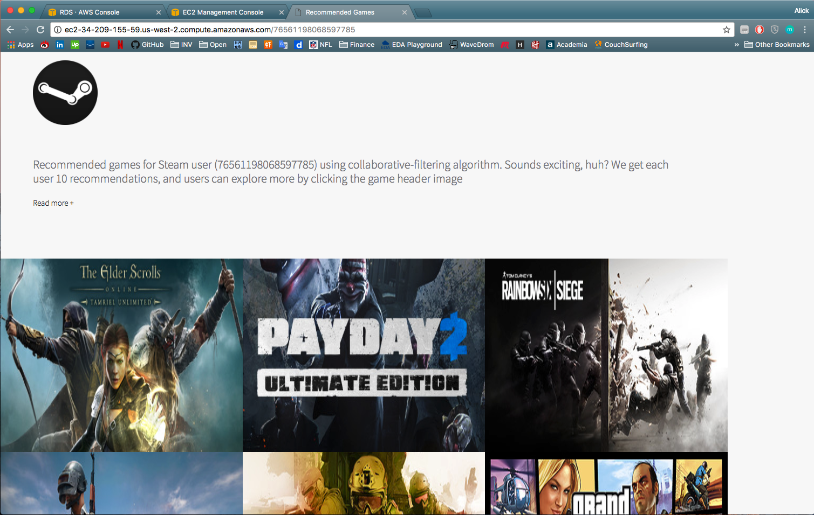

This project is divided into three phases

## Web Crawler

By using Python request package, user and game data are extracted from STEAM website/official API. Both single threaded and multi-threaded web crawler solutions are explored. Sample data is used for exploratory data analysis, while full data is used for the actual ETL

## Recommendation_Engine

Both popularity-based recommendation and colloborative filtering recommendation are utilized. Recommendation results are uploaded to AWS RDS for data dashboard

## Data Dashboard

A flaskr app is developed for data dashboard, which is later deployed in AWS EC2. The flask app deployment can be really tricky, the detailed steps are well documented. The dashboard will extract data from AWS RDS created in previous step

## Current Scope & Future Improvement

A simple UI looks like this:

A diagram of Lambda Architecture is shown below. Currently I only implemented the batch layer and serving layer, but not speed layer/real-time processing; This would be a future improvement.

